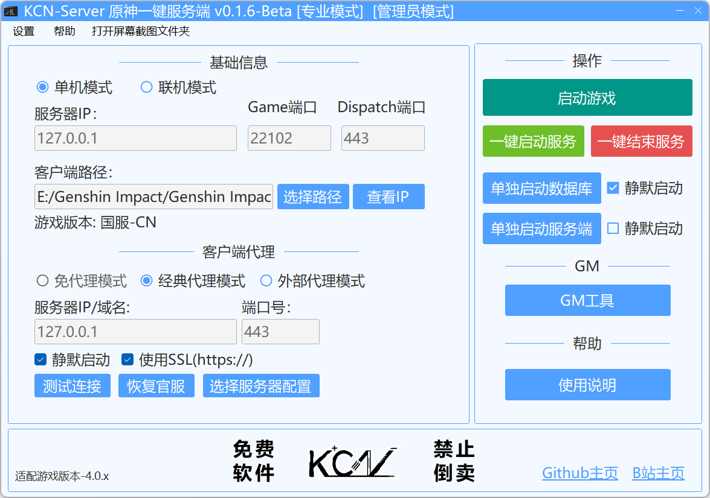
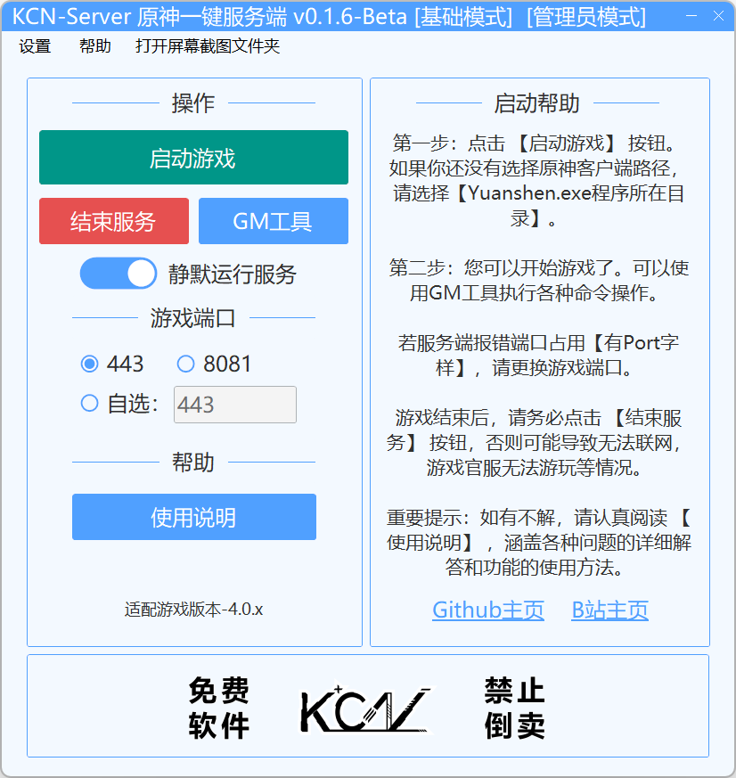

# KCN-GenshinServer

### 简体中文|[English](README_EN.md)

> 基于GC制作的原神一键GUI多功能服务端。

---

### 关于软件
- 软件还不完善，就多谢大家debug&提issues了！将来可能会写一些方便的新功能，敬请期待喵~ 
- 教程和疑难解答详见GitHub Wiki，请认真阅读后再开始搭建！
 > - 当前支持的游戏版本：4.0.0 - 4.0.1 
 > - **仅注明支持的游戏版本可用，其余版本均不可用，否则报错4214！**
 > - 当前启动器版本：v0.1.7-Beta

### 软件下载
- 请到最新[Releases](https://github.com/JDDKCN/KCN-GenshinServer/releases/)处下载。

### 软件帮助
  #### 软件帮助&使用说明传送门： [GithubWiki - 软件使用指南](https://github.com/JDDKCN/KCN-GenshinServer/wiki/)
  - 请务必仔细阅读帮助文档，这很重要！

### 软件截图
**[专业模式] v0.1.6-Beta**

**[基础模式] v0.1.6-Beta**

### 更新日志
- v0.1.7-Beta 2023/10/16
  1. 更新服务端构建版本至 [#2403](https://github.com/Grasscutters/Grasscutter/pull/2403) ，详见说明页。更新了Res资源。
  2. 删除禁用的免代理功能，添加 `内置代理模式` ，您可以使用内置代理启动游戏。您可以在顶部工具栏-设置-内部代理设置中自定义旁路代理。
  3. 添加关闭提示窗体，可以在顶部工具栏-设置-关闭设置选项中找到。您可以选择最小化至系统托盘或直接退出程序，您也可以选择关闭时结束所有服务。您可以勾选 `不再提醒` 单选框，该窗体将不再弹出。
  4. 添加 `代理记忆工具`，在顶部工具栏-设置-代理记忆工具中。您可以在游玩后结束服务时自动恢复原来的系统代理，或恢复自定义代理内容。若开启服务时系统代理处于关闭状态则无效。
  5. 添加 `端口工具` ，在顶部工具栏-设置-端口工具中。您可以自行查看并结束相应代理，支持查看TCP/UDP协议，本地/外部地址，程序PID及程序名称。
  6. 修复 `Mod功能` ，它现在应该可以正常工作了。
  7. 修复了一些小bug，增强软件稳定性。

- v0.1.6-Beta 2023/09/14
  1. 更新服务端至稳定版 [1.7.1](https://github.com/Grasscutters/Grasscutter/releases/tag/v1.7.1) ，修复了无法触发剧情的bug。更新了Res资源。
  2. 添加 `基础模式` 和 `专业模式` ，基础模式界面简单，功能集成，对初次接触的用户友好。您可以在设置选项卡中随时切换两种模式。
  3. 添加 `插件管理工具` ，您可以方便的管理您的插件。
  4. 优化Mod模块功能，加入 `卸载3dmigoto` 选项。
  5. 优化了软件UI，使用匹配窗体样式的消息框弹窗。
  6. 重构了一些代码，修复了一些bug。
  
- v0.1.5-Beta 2023/08/30
  1. 更新服务端构建版本至 [#2322](https://github.com/Grasscutters/Grasscutter/pull/2322) ，修复了很多bug。更新了Res资源和GCTools。
  2. 将MOD功能移入了顶部工具栏-设置-Mod(3dmigoto)工具中，前MOD功能区域换成了帮助按钮。这是因为许多用户无法找到帮助。
  3. 添加数据库工具，在顶部工具栏-设置-数据库工具中，删除了原删库功能。现在，您可以备份/还原/删除数据库数据。需要连接数据库进行操作。
  4. 添加SSL工具，在顶部工具栏-设置-网络安全证书(SSL)工具中，您可以导入SSL证书并开启SSL功能。注意：使用无效SSL证书会使服务端无法连接。
  5. 添加外部代理模式，您可以使用外部代理程序来代理游戏请求。请认真检查服务端和外部代理正常工作后再启动游戏，启动器将不做任何检测。
  6. 新增初次打开时的弹窗等：初次使用请看帮助，同时打开帮助页。此弹窗仅会显示一次。
  7. 优化软件逻辑，修复了一些bug，优化了UI。

- v0.1.4.1-Beta 2023/08/24
  1. 更新服务端到4.0.1版本。
  2. 因用户反馈，加入了一键解锁账号权限的功能。
  3. 拓展测试连接功能，支持服务端状态展示。
  4. 更新了GCTools，加入了4.0版本的资源支持。

- v0.1.4-Beta 2023/08/20
  1. 更新服务端至4.0版本：支持了任务。enjoy it :)
  2. 添加选择服务器配置功能。您可以选择与记录服务器信息。
  3. 添加替换服务端版本功能。您可以自由选择程序启动的GC核心。
  4. 添加导入程序配置功能。您可以将老版本的配置数据迁移至新版本。
  5. 优化了UI，使用WebView2组件。
  6. 修复了一些bug，重构了一些功能代码，改善用户体验。

- v0.1.3.1-Beta 2023/06/16
  1. 紧急修复了单机模式无法使用的bug，修复了用户反馈的其它几个小bug。
  2. 现在，右键结束服务按钮选项卡，您可以选择仅结束系统代理/仅结束服务进程。
  3. 添加核心鉴别功能，替换非官方核心将会在左下角显示提示。非官方核心可能会被植入恶意代码。

- v0.1.3-Beta 2023/06/15
  1. 添加日志记录功能，以markdown文档形式记录。您可以在设置-程序日志查看器中查看日志。
  2. 添加卡池替换功能。您可以在设置-卡池设置中替换您想要的UP池。卡池文件来源于 [赵苦瓜](https://github.com/Zhaokugua) 的 [Grasscutter_Banners](https://github.com/Zhaokugua/Grasscutter_Banners) 存储库。感谢他的整理。
  3. 修复了一轮bug。改进了UI。优化软件逻辑。
  
- v0.1.2-Beta 2023/06/04
  1. 优化软件逻辑，修复了一些用户反馈的bug。
  2. 添加离线用户帮助文档。您可以在程序内右键-点击使用说明选项打开。
  3. 在顶部工具栏添加了打开屏幕截图文件夹的小功能。

- v0.1.1-Beta 2023/06/01
  1. 修复了用户反馈的一些bug。
  2. 添加了一些新的设置功能。
  3. 强制管理员模式运行。

- v0.1.0-Beta 2023/05/29
  1. 发布了软件。

### 系统支持
| 系统           | 可用性    | 系统         | 可用性    |
|---------------|----------|--------------|----------|
| Windows 11    | 支持     | Windows XP   | 不支持    |
| Windows 10    | 支持     | Mac OS       | 不支持    |
| Windows 7 - 8 | 不支持   | Linux        | 不支持    |

### 免责声明
- 本程序是基于Github开源项目[Grasscutter](https://github.com/Grasscutters/Grasscutter)制作的原神一键GUI多功能服务端，仅供研究交流用，禁止用于商业及非法用途。使用本软件造成的事故与损失，与作者无关。本程序完全免费，如果您是花钱买的，说明您被骗了。请尽快退款，以减少您的损失。

### 联系方式
- [前往我的B站首页](https://space.bilibili.com/475547854/)
- [前往我的Twitter账号](https://twitter.com/2233KCN)
