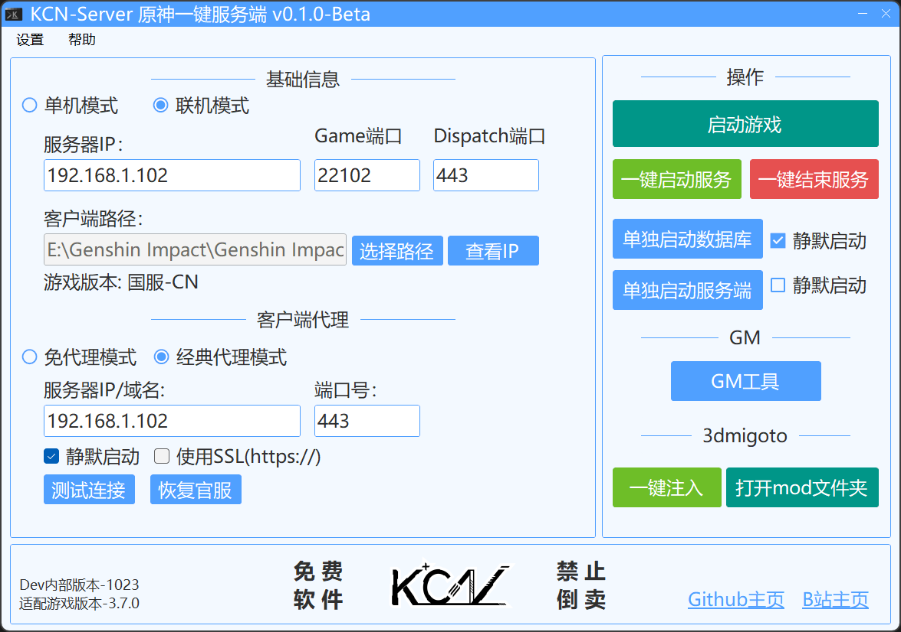

# KCN-GenshinServer

### 简体中文|[English](README_EN.md)


> 基于GC制作的原神一键GUI多功能服务端。

---

### 关于软件
- 软件还不完善，就多谢大家debug&提issues了！将来可能会写一些方便的新功能，敬请期待喵~ 
- 教程和疑难解答都在页面下方，请认真阅读后再开始搭建！
 > 当前服务端版本：4.0.0

### 软件下载
- 请到最新[Releases](https://github.com/JDDKCN/KCN-GenshinServer/releases/)处下载。

### 软件截图
- v0.1.0-Beta 2023/05/29


### 更新日志
- v0.1.4-Beta 2023/08/20
  1. 更新服务端至4.0版本：支持了任务。enjoy it :)
  2. 添加选择服务器配置功能。您可以选择与记录服务器信息。
  3. 添加替换服务端版本功能。您可以自由选择程序启动的GC核心。
  4. 添加导入程序配置功能。您可以将老版本的配置数据迁移至新版本。
  5. 优化了UI，使用WebView2组件。
  6. 修复了一些bug，重构了一些功能代码，改善用户体验。

- v0.1.3.1-Beta 2023/06/16
  1. 紧急修复了单机模式无法使用的bug，修复了用户反馈的其它几个小bug。
  2. 现在，右键结束服务按钮选项卡，您可以选择仅结束系统代理/仅结束服务进程。
  3. 添加核心鉴别功能，替换非官方核心将会在左下角显示提示。非官方核心可能会被植入恶意代码。

- v0.1.3-Beta 2023/06/15
  1. 添加日志记录功能，以markdown文档形式记录。您可以在设置-程序日志查看器中查看日志。
  2. 添加卡池替换功能。您可以在设置-卡池设置中替换您想要的UP池。卡池文件来源于 [赵苦瓜](https://github.com/Zhaokugua) 的 [Grasscutter_Banners](https://github.com/Zhaokugua/Grasscutter_Banners) 存储库。感谢他的整理。
  3. 修复了一轮bug。改进了UI。优化软件逻辑。
  
- v0.1.2-Beta 2023/06/04
  1. 优化软件逻辑，修复了一些用户反馈的bug。
  2. 添加离线用户帮助文档。您可以在程序内右键-点击使用说明选项打开。
  3. 在顶部工具栏添加了打开屏幕截图文件夹的小功能。

- v0.1.1-Beta 2023/06/01
  1. 修复了用户反馈的一些bug。
  2. 添加了一些新的设置功能。
  3. 强制管理员模式运行。

- v0.1.0-Beta 2023/05/29
  1. 发布了软件。

### 系统支持

| 系统           | 可用性    | 系统         | 可用性    |
|---------------|----------|--------------|----------|
| Windows 11    | 支持     | Windows XP   | 不支持    |
| Windows 10    | 支持     | Mac OS       | 不支持    |
| Windows 7 - 8 | 不支持   | Linux        | 不支持    |

### 程序使用说明
- **首次启动(单机模式)**
  1. 选择你的原神客户端路径。
  2. 点击<一键启动服务>按钮。这会启动数据库以及服务端进程。
  3. 点击<启动游戏>按钮。这会启动代理进程及游戏。如果程序没有在您的计算机上检测到mimproxy的CA证书，程序将会打开安装程序。请您在弹出的安装证书对话框中点击安装。
  4. 您可以开始游戏了。Enjoy it😊

- **联机(本地服务器)**
  1. 选择联机模式按钮。(基础信息-左上角)
  2. 在基础信息-服务器IP文本框中，填入本机内网/公网IP地址。如果您不知道IP，请点击查看IP按钮，将IP地址复制到文本框中。
  3. 在客户端代理-服务器IP/域名文本框中，填入刚才输入的IP地址。如果不知道，请不要勾选<使用SSL>单选框。本端的本地GC服务默认为Http协议，无需勾选。
  4. 点击<一键启动服务>按钮，此时你已经可以在局域网/公网中联机了。
  5. 点击客户端代理-测试连接按钮。如果服务启动成功，您会看到连接成功的提示。
  6. 点击<启动游戏>按钮，开启代理并进入游戏。

- **联机(远程服务器)**
  1. 选择联机模式按钮。(基础信息-左上角)
  2. 在客户端代理中输入要连接的远程服务端IP/域名。不要输入http(s)://,如果您的连接是Https连接，那么请勾选<使用SSL>单选框。如果您的连接是Http连接，则请不要勾选。
  3. 点击<测试连接>按钮。如果远程服务器可用，您会看到连接成功的提示。
  4. 点击<启动游戏>按钮，开启代理并进入游戏。

- **注入Mod(3dmigoto)**
  1. 请点击3dmigoto-一键注入按钮。程序将启动注入程序及原神主程序。如果在启动后看见程序上下边栏出现绿色的字母/数字，则说明注入成功。
  2. 请点击3dmigoto-打开mod文件夹按钮，把解压好的mod放入文件夹中，重启游戏即可。

- **GM工具**
  1. 请前往[GrasscutterTools](https://github.com/jie65535/GrasscutterCommandGenerator)项目查看具体使用方法。
  2. 在单机模式下连接时，服务器地址请填写`http://127.0.0.1:443`。连接玩家账号时，玩家必须在线。

- **更改卡池**
  1. 请打开设置-卡池设置页面。
  2. 列表中包含了到目前为止所有版本UP池(不包括CB版本)，选中想要的卡池，点击替换。重启服务即可生效。

### 疑难解答&问题说明
> 以下问题是网友普遍反馈的问题&想要了解的事项，基本涵盖了大部分用户可能会遇到的问题。该条目会随时补充，欢迎私信或提issues。

- **Java问题1**：无法安装Java & 以下开关中存在错误
  1. 将软件关闭，右键-以管理员身份运行
  2. 重新安装，安装路径下请不要有中文字符。
  3. 如果还是无法安装，请自行打开软件根目录下的Server\plugin\jdk17.exe程序安装。

- **Java问题2**：服务端启动出错
  - 如果你的报错信息和下面给出的示例类似，那么这个解决方法适合你：可能是计算机上安装的Java版本太高。

  ```java
  Error: A JNI error has occurred, please check your installation and try again Exception in thread "main" java. lang. UnsupportedClassVersionError: emu/grasscutter/Grasscutter has been compiled by a more recent version of the Java Runtime (class file version 61.0), this version of the Java Runtime only recognizes class
  file versions up to 52.0
  ```

  1. 请卸载计算机当前版本的Java。卸载完成后以管理员身份运行程序，点击一键启动服务，安装jdk17。注意安装路径下请不要有中文字符。
  2. 服务端启动成功后，会显示"加载完成！"字样。

- **Java问题3**：安装好Java后还是会提示找不到Java
  1. 这种情况一般是因为安装程序没有修改Path(环境变量)。
  2. 要更改Path，请前往Windows设置-系统-系统信息-高级系统设置-右下角环境变量中设置。打开环境变量设置，你应该会在上半边的列表中找到Path。点击编辑-新建，在文字编辑框内填入你刚才安装的Java的路径。注意，要填写java.exe所在路径，一般在bin文件夹中。

- **网络问题**：服务器通讯错误
  1. 请先开启服务端，等待服务端启动完毕后再测试连接。
  2. 查看IP是否填写正确。
  3. 如果还是报错，查看服务端是否启动成功。如果服务端未正确启动，可能是端口占用问题或者Java版本问题，请查看上述条目。

- **网络服务商导致的网络问题**：游戏里提示：网络超时，请稍后再试。
  1. 请先确保您的服务端正确启动，代理正确启动。
  2. 如果一切正常，请检查您的网络。由用户反馈的信息，校园网可能无法正确代理游戏，目前暂不知道原因与解决方法，猜测可能是对网关进行了某些限制。

- **端口占用**：服务端无法正确启动。
  - 如果你的报错信息和下面给出的示例类似，那么这个解决方法适合你：端口被占用。

  ```java
  Exception in thread "main" io.javalin.util.JavalinBindException: Port already in use. Make sure no other process is using port 443 and try again.
  ```

  1. 如果您正处于*单机模式*，请切换至*联机模式*。
  2. 在*基础信息*和*客户端代理*中的*服务器IP*输入框中填入 `127.0.0.1`(单机模式)或您电脑的局域网/公网IP(联机模式)。
  3. 替换被占用的端口(一般是dispatch的443端口)，将dispatch改成8081即可。如果仍占用，改为其它数字重试。客户端代理的端口号同dispatch端口号。在连接GM工具时，请把链接后面的数字改成dispatch端口号(如`http://127.0.0.1:8081`)。

- **代理问题1**：游戏里提示：网络超时，请稍后再试。
  1. 这种情况大概率是未正确安装CA证书造成的错误。点击左上角设置-手动安装CA证书，如果提示未找到证书，请先打开代理，使其生成证书后再试。
  2. 如果仍然不可行/提示安装错误，请到装有Windows系统的盘符根目录下找到用户(users)文件夹，进入并找到自己的账户文件夹，接着找到.mitmproxy文件夹，安装文件夹内的mitmproxy-ca.p12证书文件。

- **代理问题2**：和其他软件冲突
  1. 在开启代理后，其它代理软件将不能使用，例如Clash或者v2。您需要在结束游戏后重新开启一遍代理。

- **账号问题**：游戏登录时提示找不到UID或者账户不存在
  1. 可以点击左上角设置-开启自动创建账号，这样服务端会自动给不存在的用户名创建新账号。
  2. 也可以在服务端控制台上使用命令创建账号。使用[account create {你想要的用户名}  {UID}]命令。举例：account create KCN 10001 就是创建用户名为KCN，UID为10001的账号。登录时请填入你的用户名而不是UID。【输命令的时候不要加括号！】
  3. 密码：没密码，密码框随便输就行，别空着。

- **GM工具问题**：你没有权限执行此命令。
  1. 请在GM工具中点击"管理"选项，在权限管理一栏中，输入你目前账号的UID，选择 `*` (开放该账号所有权限)，点击添加。
  2. 请把生成的命令复制到服务端的命令行窗口中，回车执行。这样，你的账号就可以使用所有命令了。【服务端不是GM工具，是黑色的命令提示符窗口】
  3. 你也可以直接输入以下命令(在服务端窗口内)：permission add @10001 * 【10001处换为你的UID】。

- **路径问题**：找不到xxx组件
  1. 这个错误一般是移动了文件夹位置/未完整解压缩文件导致的。请仔细检查是否完整的解压了一键端所有文件。
  2. 如果一键端文件完整，请把一键端根目录下的config.json文件删除，然后重新打开，使其重新生成。

- **客户端问题**：数据异常，请完全卸载游戏，并从官方渠道重新下载安装(错误码 31-4302)
  1. 这个错误一般是在YusnShen.exe游戏目录下移动复制了其它文件所导致的。
  2. 要解决这个错误，请删除YusnShen.exe游戏目录下多余的文件(补丁文件除外)。

- **其它网友关心的问题的解答**
  - Q:使用私服安全吗？会被封号吗？会被监控吗？
  - A:不会的。使用私服很安全，你的数据不会被发送到米哈游服务器，因为代理程序会把客户端发送出的数据截获，然后发送给在本地电脑上的服务端。所以完全没有封号风险，也不会被监控。

  - Q:有没有手机版？
  - A:本项目是一键服务端，手机版原神属于游戏客户端。本项目不提供游戏客户端。如果你有相同版本的手机版客户端，那么当然可以连接电脑上的服务端游玩了，只要在手机版客户端里输入你设置的服务端的IP地址即可。

  - Q:国服&国际服都能用吗？
  - A:是的，通用。

  - Q:会持续更新吗？
  - A:会的。

  - Q:有教程吗？
  - A:眼瞎？

### 免责声明
- 本程序是基于Github开源项目[Grasscutter](https://github.com/Grasscutters/Grasscutter)制作的原神一键GUI多功能服务端，仅供研究交流用，禁止用于商业及非法用途。使用本软件造成的事故与损失，与作者无关。本程序完全免费，如果您是花钱买的，说明您被骗了。请尽快退款，以减少您的损失。

### 联系方式
- [前往我的B站首页](https://space.bilibili.com/475547854/)
- [前往我的Twitter账号](https://twitter.com/2233KCN)